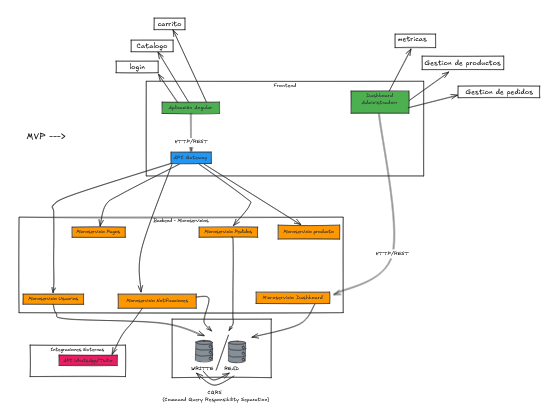

# Informe Técnico y de Lógica de Negocio

## MVP de Ecommerce Modular

### 1. Introducción

El presente informe describe la lógica de negocio y las especificaciones técnicas para el desarrollo del MVP de un ecommerce modular. La solución propuesta se basa en una arquitectura de microservicios, con los siguientes componentes principales:
- **Frontend**: Aplicación Angular (Single Page Application).
- **Backend**: API Gateway con microservicios desarrollados en Spring Boot.
- **Base de Datos**: PostgreSQL, unificada para todos los servicios.
- **Notificaciones**: Servidor SMTP, con integración futura a WhatsApp.

El diseño modular prioriza la escalabilidad, mantenibilidad y una experiencia de usuario optimizada, permitiendo la incorporación de nuevas funcionalidades sin afectar el sistema global. Este documento servirá como guía para el desarrollo, integración y validación del sistema.

### 2. Objetivos del Proyecto

1. **Validar el modelo de negocio**: Implementar funcionalidades básicas de ecommerce para probar la viabilidad del producto en el mercado.
2. **Optimizar la experiencia de usuario**: Facilitar la navegación, búsqueda de productos y proceso de compra con un diseño intuitivo y responsivo.
3. **Implementar una arquitectura escalable**: Utilizar microservicios para permitir el crecimiento y la incorporación de nuevas funcionalidades sin afectar el sistema global.
4. **Preparar integraciones futuras**: Establecer las bases para la integración con pasarelas de pago (MercadoPago) y sistemas de notificaciones avanzadas (WhatsApp).

### 3. Arquitectura del Sistema

#### 3.1 Diagrama de Flujo

(Aquí se incluirá el diagrama de flujo de procesos, que se mantendrá actualizado conforme avance el desarrollo.)

### 4. Lógica de Negocio

#### 4.1 Frontend (Aplicación Angular)

- **Login/Registro**:
  - Autenticación JWT con refresh tokens.
  - Validación en tiempo real de formularios.
  - Roles: usuario y administrador.

- **Catálogo de Productos**:
  - Vista grid/list con paginación.
  - Filtros por nombre y categorías.
  - Lazy loading para imágenes.

- **Carrito de Compras**:
  - Persistencia en localStorage.
  - Validación de stock en tiempo real.
  - Cálculo dinámico de totales.

- **Checkout**:
  - Proceso de 3 pasos: autenticación, datos de envío/facturación, y confirmación.
  - Generación de pedido en estado "Pendiente".

#### 4.2 Backend (Microservicios)

##### Servicio de Usuarios (Auth)

- **Responsabilidades**:
  - Registro y autenticación de usuarios.
  - Gestión de perfiles y roles (usuario/administrador).

- **Endpoints clave**:
  - `POST /auth/login` – Inicio de sesión.
  - `POST /auth/register` – Registro.
  - `GET /users/me` – Obtener perfil del usuario.

##### Servicio de Productos

- **Responsabilidades**:
  - CRUD de productos y categorías.
  - Búsqueda y filtrado de productos.

- **Endpoints clave**:
  - `GET /products?filter={}` – Listado con filtros.
  - `POST /products` – Creación de productos.

##### Servicio de Pedidos

- **Responsabilidades**:
  - Gestión del carrito y validación de stock.
  - Cálculo de totales y gestión de estados de pedido.

- **Endpoints clave**:
  - `POST /orders` – Creación de pedido.
  - `PATCH /orders/{id}` – Actualización de estado.

##### Servicio de Notificaciones

- **Responsabilidades**:
  - Envío de emails automáticos (SMTP).
  - Integración futura con WhatsApp para notificaciones avanzadas.

- **Endpoints clave**:
  - `POST /notifications` – Envío de notificaciones.

##### Servicio de Dashboard

- **Responsabilidades**:
  - Agregación de métricas y reportes.
  - Gestión administrativa (CRUD de productos, seguimiento de pedidos).

- **Endpoints clave**:
  - `GET /metrics/sales` – Métricas de ventas.
  - `GET /metrics/users` – Métricas de usuarios.

### 5. Especificaciones Técnicas

#### 5.1 Stack Tecnológico

- **Backend**:
  - Lenguaje: Java.
  - Framework: Spring Boot.
  - Comunicación: HTTP/REST (a través de un API Gateway) y, de ser necesario, mensajería asíncrona.
  - Herramientas: Spring Security, Spring Data JPA, Flyway/Liquibase.

- **Frontend**:
  - Framework: Angular.
  - Bibliotecas: Angular Material (u otra similar) para la interfaz y componentes responsivos.
  - Estado: localStorage para el carrito (MVP), con posibilidad de migrar a NgRx en futuras iteraciones.

- **Base de Datos**:
  - Sistema: PostgreSQL.
  - Acceso: Spring Data JPA.
  - Migraciones: Flyway o Liquibase para gestionar cambios en el esquema.

#### 5.2 Arquitectura del Sistema

- **Frontend (Angular)**:
  - Aplicación web para clientes y un dashboard administrativo para gestión de métricas y productos.
  - Diseño responsivo y optimizado para SEO.

- **Backend (Microservicios en Java - Spring Boot)**:
  - Cada microservicio se encargará de una responsabilidad específica (usuarios, productos, pedidos, notificaciones, dashboard).
  - Un API Gateway centraliza la comunicación con el frontend, gestionando aspectos de seguridad, CORS y enrutamiento.

- **Base de Datos (PostgreSQL)**:
  - Modelo relacional con tablas para usuarios, productos, pedidos y detalle de pedidos.
  - Uso de migraciones (Flyway o Liquibase) para gestionar cambios en el esquema de forma controlada.

### 6. Sugerencias y Recomendaciones

#### 6.1 Comunicación entre Microservicios

- **Enfoque Inicial (HTTP/REST)**:
  - La comunicación entre microservicios se realizará principalmente a través de APIs REST, facilitando la integración mediante el API Gateway.

- **Estrategia Asíncrona (Futuro)**:
  - Implementar un bus de mensajería (RabbitMQ o Apache Kafka) para manejar operaciones asíncronas, como actualización de stock o envíos masivos de notificaciones.
  - Beneficios: Desacoplamiento, escalabilidad y tolerancia a fallos.

#### 6.2 Seguridad y Gestión de Sesiones

- **Autenticación y Autorización**:
  - Implementar JWT con refresh tokens para la autenticación.
  - Revisar la revocación de tokens y establecer reglas de acceso específicas según roles (usuario y administrador).

- **Protección de Endpoints**:
  - Configurar adecuadamente CORS en el API Gateway y cada microservicio.
  - Usar Spring Security para la protección y definición de reglas de acceso.

#### 6.3 Optimización del Frontend en Angular

- **Gestión del Estado y Lazy Loading**:
  - Usar localStorage para el carrito en el MVP y evaluar un servicio centralizado o NgRx en futuras iteraciones.
  - Implementar lazy loading para módulos e imágenes, mejorando la experiencia en conexiones lentas.

- **Validación y Feedback**:
  - Garantizar validaciones robustas en formularios de login, registro y checkout, con mensajes claros y feedback visual inmediato.

#### 6.4 Monitoreo y Escalabilidad

- **Herramientas de Monitoreo**:
  - Utilizar Prometheus y Grafana para monitorear métricas de rendimiento y detectar posibles cuellos de botella.
  - Configurar logging centralizado (por ejemplo, ELK Stack) para facilitar la detección y resolución de incidencias.

- **CI/CD y Escalabilidad de la Infraestructura**:
  - Configurar pipelines de integración y despliegue continuo para asegurar la calidad del código y una rápida iteración.
  - Evaluar la contenedorización (Docker) y orquestación (Kubernetes) para facilitar el escalado automático en función de la demanda.

### 7. Conclusión

El presente informe integra la lógica de negocio y las especificaciones técnicas para el desarrollo del MVP de un ecommerce modular. La solución propuesta, basada en microservicios utilizando Java (Spring Boot), Angular y PostgreSQL, está diseñada para ser escalable, mantenible y preparada para integraciones futuras. 

